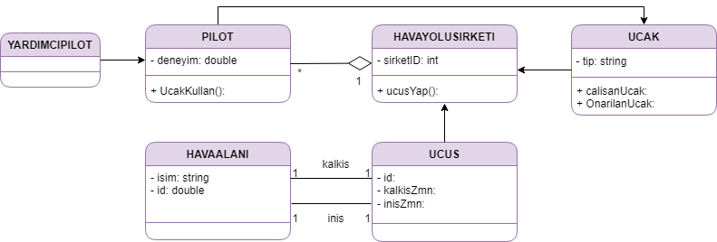

# Ucus Yonetim Sistemi

.png dosyasında uçuşların ve pilotların yönetimi için bir sistem tasarımı vardır. Bu sistem aşağıda tasvir edildiği haliyle Class(Sınıf) diyagramı formatındadır.

1- Hava yolu şirketleri uçuşları gerçekleştirir. Her hava yolunun bir kimliği vardır.
2- Hava yolu şirketi, farklı tipteki uçaklara sahiptir.
3- Uçaklar çalışır veya onarım durumunda olabilir.
4- Her uçuşun benzersiz kimliği, kalkacağı ve ineceği havaalanı, kalkış ve iniş saatleri vardır.
5- Her uçuşun bir pilotu ve yardımcı pilotu vardır ve uçağı kullanırlar.
6- Havaalanlarının benzersiz kimlikleri ve isimleri vardır.
7- Hava yolu şirketlerinin pilotları vardır ve her pilotun bir deneyim seviyesi mevcuttur.
8- Bir uçak tipi, belirli sayıda pilota ihtiyaç duyabilir.

